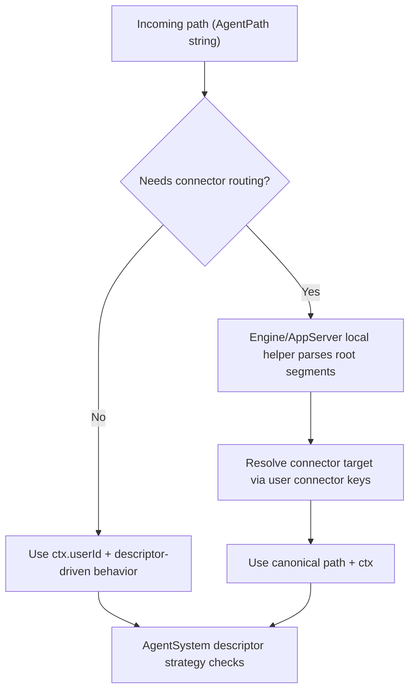

# Path Identity as Opaque Strings (2026-03-01)

## Summary

The runtime now treats agent paths as opaque branded strings.
Backend-wide path kind parsing utilities were removed.

Path classification now lives in two places only:

- local, private helpers where routing absolutely requires it (`Engine`, `AgentSystem`)
- client/dashboard code for display-level type rendering

## What changed

- Removed backend shared path-kind/parsing modules:
  - `agentPathParse.ts`
  - `agentPathMatchesStrategy.ts`
  - `agentPathRoleResolve.ts`
- Removed `AgentPathKind` from shared types.
- Replaced path-kind strategy selection with descriptor-based matching:
  - `agentDescriptorMatchesStrategy` now drives foreground selection.
- Switched runtime flows to descriptor-first logic:
  - `AgentSystem.postToUserAgents` uses `descriptor.type === "user"`.
  - `MemoryWorker` uses descriptor types for memory/foreground decisions.
- `Engine` and `AppServer` now use local path segment helpers only where needed for connector routing.

## Flow

