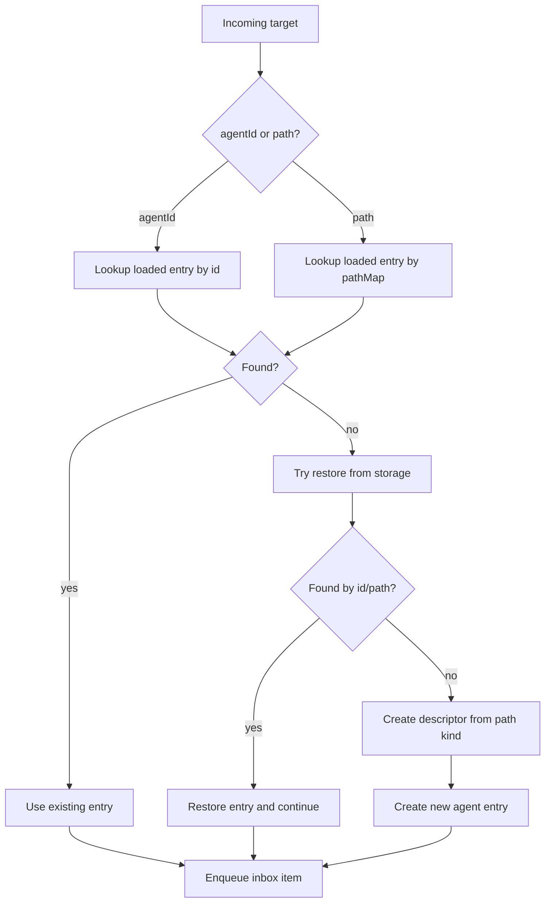

# Path-Only Agent Target Routing

## Summary

This change removes descriptor-based target resolution from runtime routing paths in `AgentSystem`.
`AgentPostTarget` now resolves only by `agentId` or `path`, and descriptor fixtures in tests are normalized to path targets before posting.

## What Changed

- `AgentSystem.findLoadedEntry()` no longer checks `target.descriptor`.
- `AgentSystem.resolveEntry()` no longer has descriptor-target creation/restore branch.
- `postToUserAgents()` filters frontend agents by `record.path` kind (`connector`) only.
- Agent fetch strategy matching prefers path strategy resolution only.
- Agent tests now allocate/use explicit child paths for subagents.

## Routing Flow

## Notes

- Descriptor objects remain as persisted/runtime metadata for now, but no longer participate in target identity resolution.
- Subagent tests now allocate child paths from parent agents to avoid non-canonical descriptor-id fallbacks.
