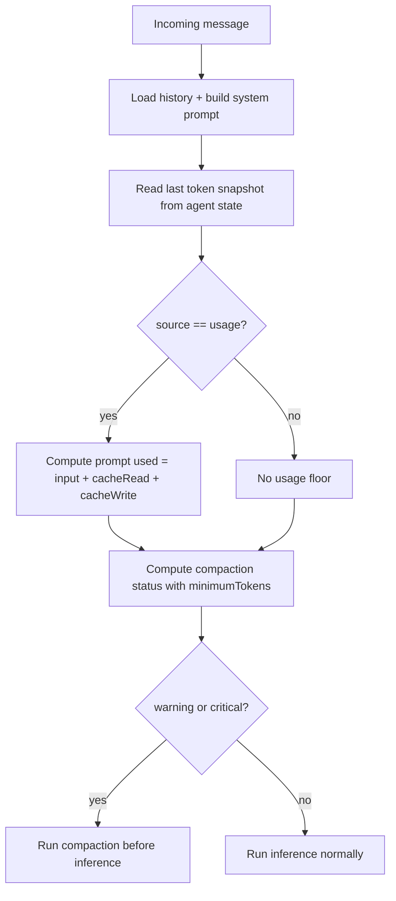

# Pre-turn compaction using provider usage tokens

## Summary

Auto-compaction now considers provider-reported prompt usage from the previous inference turn before starting a new turn.
This prevents missed compaction when heuristic history estimates undercount context-heavy sessions (for example, large tool-result context).

## What changed

- `AgentTokenEntry` now stores optional token `source` (`usage` or `estimate`).
- Inference loop persists token source when writing assistant token snapshots.
- Added `agentTokenPromptUsedFromUsage()` to extract prompt usage (`input + cacheRead + cacheWrite`) only when usage came from the provider.
- `contextCompactionStatus()` now supports `minimumTokens`, used as a floor for severity calculation.
- `Agent.handleMessage()` passes provider usage prompt tokens as `minimumTokens` before running inference.

## Behavior flow

## Notes

- Legacy token entries without `source` are treated as usage only when cached prompt tokens are present.
- If provider usage is unavailable, behavior falls back to the existing heuristic-only path.
