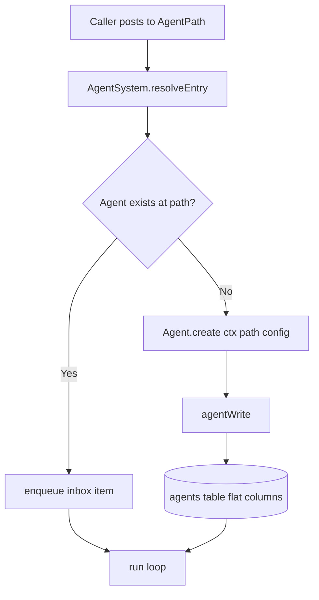

# Remove Agent Descriptors: Path-First Agents (2026-03-01)

## Summary

Agent identity is now path-first and descriptor-free.

- Agent creation routes by `AgentPath` only.
- Creation metadata comes from caller-provided `creationConfig`.
- Persistent agent configuration is stored in flat columns on `agents`.
- Descriptor bridge helpers and descriptor ops were removed.

## Storage shape

The `agents` table now persists these identity/config fields directly:

- `path` (required)
- `foreground` (required boolean)
- `name`, `description`, `system_prompt`, `workspace_dir` (nullable)

Legacy `type`, `descriptor`, and `config` JSON columns are removed by migration.

## Runtime flow

## Notes

- Foreground behavior now uses `config.foreground`, not descriptor type checks.
- Path utility ops (`agentPathKind`, `agentPathRoleResolve`, `agentPathLabel`, etc.) replace descriptor-based branching.
