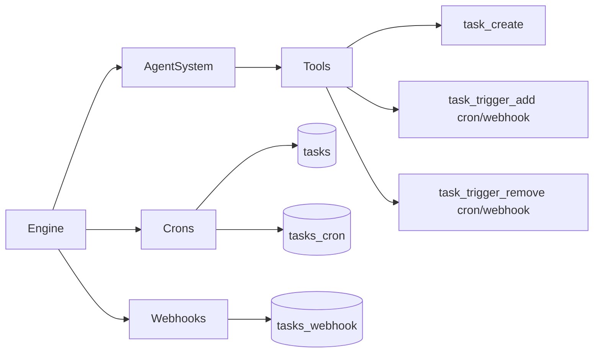
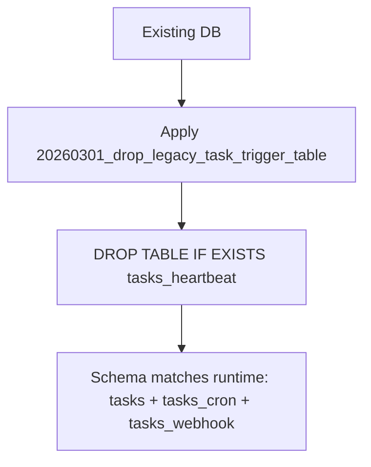

# Remove Heartbeats

## Summary

Removed heartbeat scheduling and trigger support from Daycare runtime.

- Deleted heartbeat engine module and storage repository.
- Removed heartbeat trigger type from task tools.
- Removed heartbeat wiring from `Engine`, `AgentSystem`, and tool execution context.
- Removed heartbeat API exposure from IPC server.
- Removed heartbeat model role.
- Removed heartbeat system-agent prompt registration.
- Dropped `tasks_heartbeat` with a forward migration.

## Runtime Topology (After)

## Storage Migration

## Notes

- Cron and webhook behavior are unchanged.
- `topology` now reports task cron triggers only.
- Active-task summaries now contain `cron` and `webhook` triggers.
