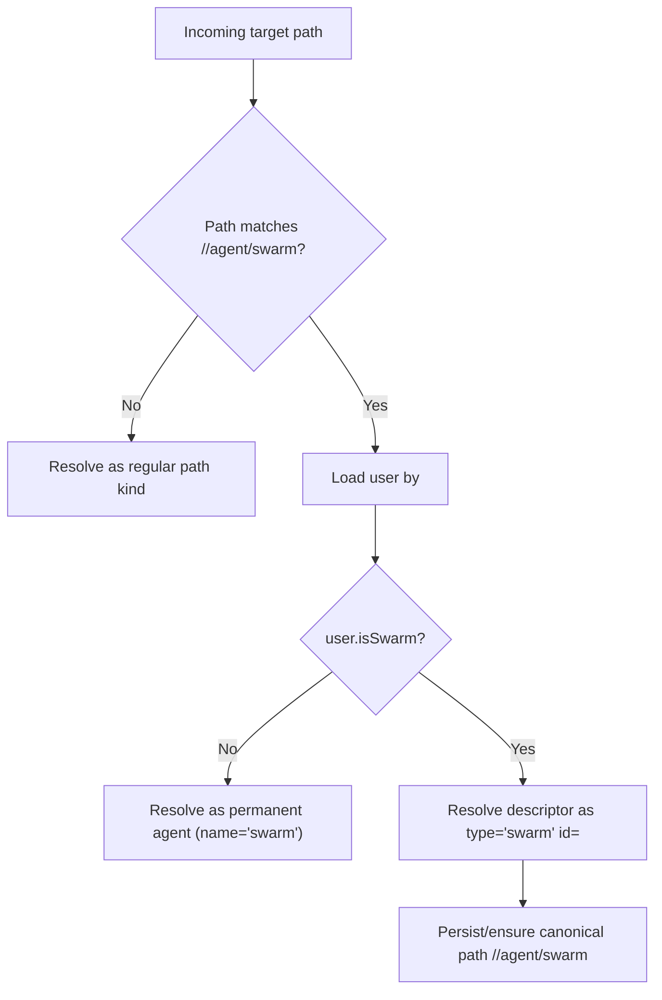

# Subuser Path Restoration (2026-03-01)

## Summary

Path-only routing introduced a regression where swarm/subuser agent paths (`/<swarmUserId>/agent/swarm`) could be resolved as permanent agents.
This made subusers appear missing in dashboards and changed runtime behavior for swarm-specific tools.

This change restores swarm resolution and keeps legacy swarm paths canonical.

## Engine fixes

- `AgentSystem.descriptorForPath` now resolves `/<userId>/agent/swarm` to `{ type: "swarm", id: userId }` when the owning user is a swarm user.
- `AgentSystem.pathEnsure` now canonicalizes persisted swarm records to the stable path `/<userId>/agent/swarm`.
- Added `AgentSystem` tests to cover:
  - new swarm creation from path targets
  - canonicalization of legacy swarm paths on load

## Dashboard fixes

- Dashboard path typing now labels `/<userId>/agent/swarm` as `subuser`.
- The static dashboard plugin uses the same path rule.

## Flow

