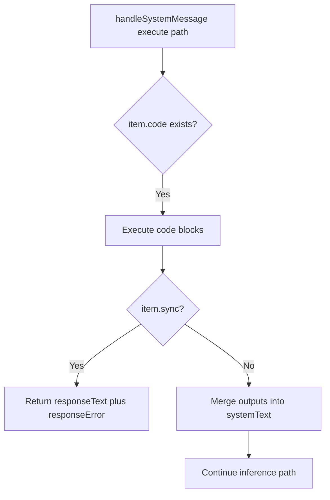

# System Message Response Error Fix

## Summary

Fixed a TypeScript build failure in `Agent.handleSystemMessage`.

- Removed an assignment to an undeclared variable (`responseError`).
- Kept existing error propagation behavior through `executionHasError` and return payloads.
- Restored successful `yarn build` for the CLI workspace.

## System Message Execute Flow

