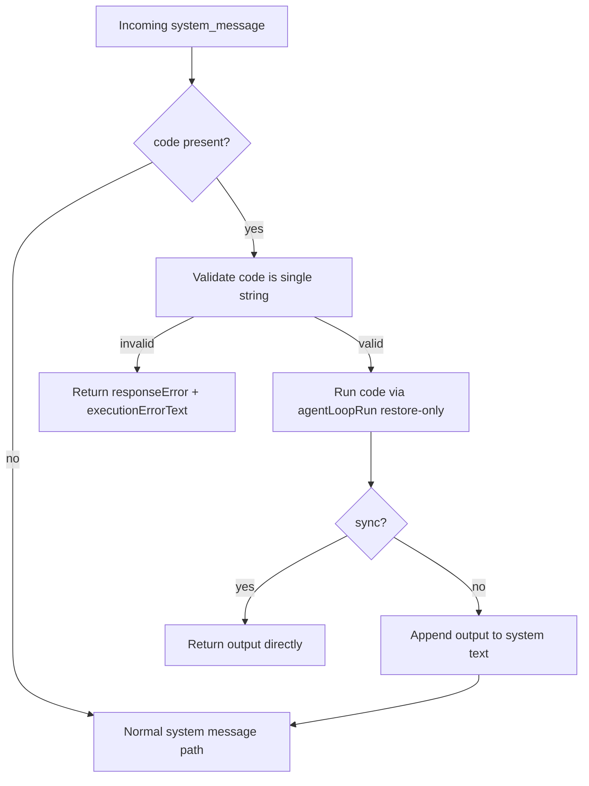

# System Message Executable Simplification

## Summary

Executable `system_message` handling now runs only when `code` is present.

Changes:
- Removed `execute` flag usage from `system_message` payloads.
- Removed `<run_python>...</run_python>` text fallback for `system_message` execution.
- Enforced a single executable payload (`code: string`) instead of multiple code blocks.
- Updated cron/webhook/task producers to send `code` as a single string.
- Kept execution on the same unified `agentLoopRun` restore-only VM path.

## Flow

