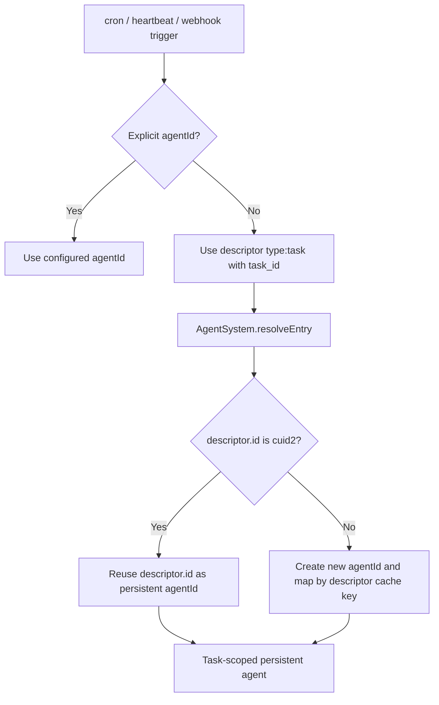

# Task Descriptor Type For Trigger Defaults

## Summary

Added a new agent descriptor variant:

- `{ type: "task", id: string }`

Cron, heartbeat, and webhook triggers now default to this descriptor when no explicit `agentId` is configured.
This isolates trigger history per task instead of sharing `system:*` agents.

Model role configuration now supports a `task` role key so task agents can use a dedicated model override.

## Resolution Flow

