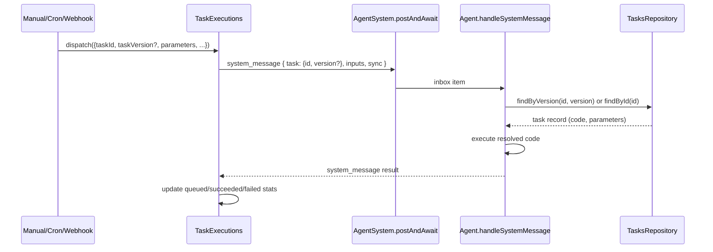
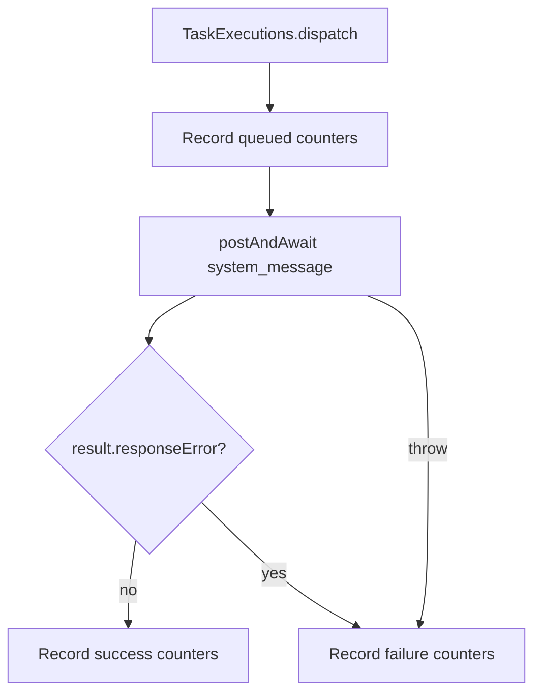

# Task Executions Facade and Task Reference Dispatch

## Summary

This change unifies manual, cron, and webhook task execution through `TaskExecutions`.
Execution payloads no longer send task code. They send only:

- task reference: `task.id` and optional `task.version`
- normalized input values (`inputs`)
- execution metadata (`origin`, `context`, `sync`)

The agent resolves task code from `TasksRepository` at execution time.

## Flow

## Facade Responsibilities

## Notes

- `task_run` async path is fire-and-forget via `dispatch`.
- `task_run` sync path uses `dispatchAndAwait` and returns code execution output.
- Cron/Webhook no longer pass task code in scheduler/trigger context.
- Engine status now exposes aggregated and per-task execution counters from `TaskExecutions`.
