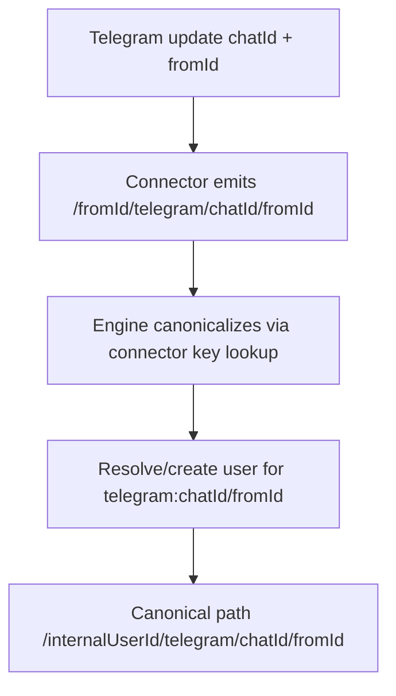
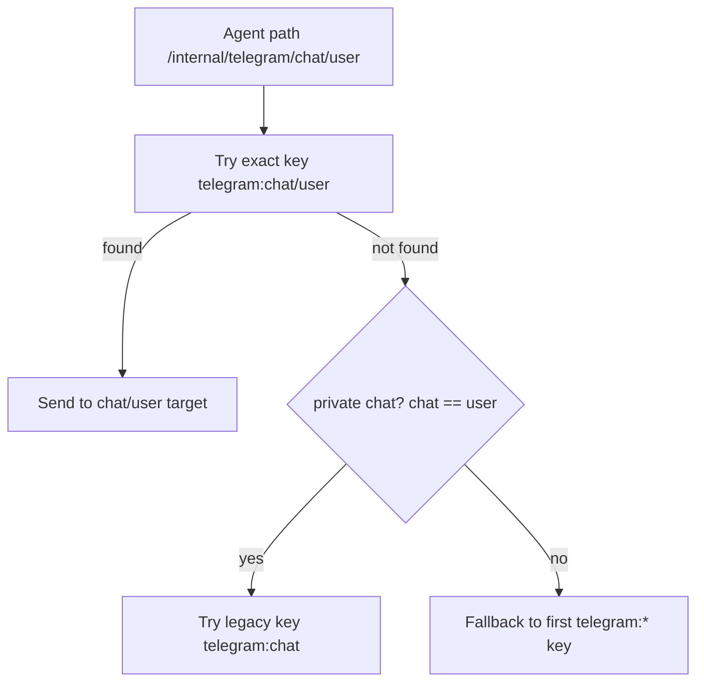

# 20260301 Telegram Channel/User Path Routing

## Summary

Telegram connector paths now include both chat and sender identity so connector resolution can disambiguate multiple users in the same channel.

- New connector path shape: `/<internalUserId>/telegram/<channelId>/<telegramUserId>`
- Incoming Telegram messages emit path hints as `/<telegramUserId>/telegram/<channelId>/<telegramUserId>` and are canonicalized to internal user scope.
- Connector target resolution prefers exact `telegram:<channelId>/<telegramUserId>` keys, with a private-chat fallback to legacy `telegram:<channelId>`.

## Routing flow

## Outbound target resolution

