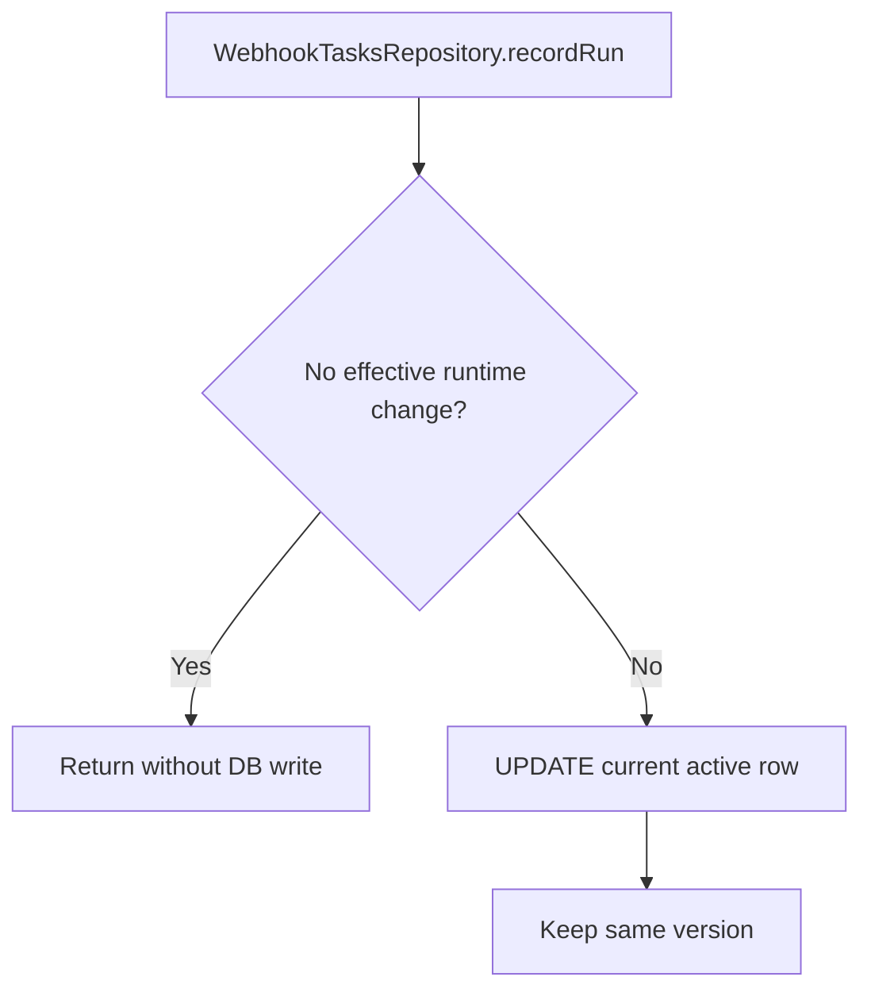

# Webhook Runtime In-Place Updates

## Summary

`WebhookTasksRepository.recordRun(...)` now avoids unnecessary `tasks_webhook` version churn:

- No-op run updates are skipped.
- Runtime run metadata (`lastRunAt`, `updatedAt`) is updated in place on the current row.
- Trigger definition lifecycle remains unchanged (`create` continues to use versioning semantics for existing ids).

This keeps webhook execution updates from creating a new trigger version per run.

## Runtime Fields (In-Place)

- `lastRunAt`
- `updatedAt`

## Flow

