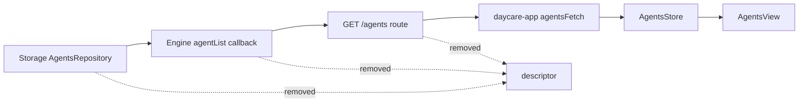

# Agent List Descriptor Removal

## Summary

Removed `descriptor` from agent list items returned by `GET /agents`.

## What Changed

- API route contract no longer includes `descriptor` in `AgentListItem`.
- `agentsList` route no longer maps or returns `descriptor`.
- Engine callback for agent list no longer emits `record.descriptor`.
- App agent types no longer define `AgentDescriptor` for list responses.
- Agents view now renders title/subtitle from `agentId`.

## Data Flow

