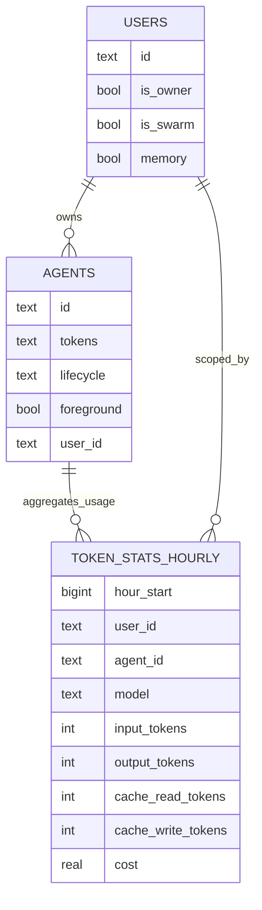

# Agent stats removal and boolean schema alignment

## Summary
- Removed legacy `agents.stats` storage from the schema and bootstrap SQL migrations.
- Kept hourly token accounting as the only persisted token stats mechanism (`token_stats_hourly`).
- Converted flag columns to proper PostgreSQL booleans across schema and migrations.
- Updated agent/storage tests and fixtures to stop using `stats` and numeric boolean values.

## Schema impact

## Migration updates
- `20260226_bootstrap.sql` and `0000_bootstrap.sql`
  - dropped `agents.stats`
  - changed boolean-like columns from `integer DEFAULT 0/1` to `boolean DEFAULT false/true`
  - updated owner uniqueness predicate and owner seed row to use boolean literals
- `20260301_agents_unified.sql`
  - changed `agents.foreground` normalization and defaults to booleans
- `20260301_swarms.sql`
  - changed `users.is_swarm` and `users.memory` to booleans
  - added robust type conversion for existing values
- `20260228_entity_versioning.sql`
  - updated `idx_users_single_owner` predicate to `is_owner = true`

## Validation
- Storage suite passed:
  - `sources/storage/agentsRepository.spec.ts`
  - `sources/storage/storage.spec.ts`
  - `sources/storage/databaseMigrate.spec.ts`
  - `sources/storage/historyRepository.spec.ts`
  - `sources/storage/sessionsRepository.spec.ts`
  - `sources/storage/tokenStatsRepository.spec.ts`
  - `sources/storage/processesRepository.spec.ts`
- Agent/memory/plugin suites touching agent fixtures passed:
  - `sources/engine/agents/agent.spec.ts`
  - `sources/engine/agents/agentSystem.spec.ts`
  - `sources/engine/agents/ops/{agentStateRead,agentStateWrite,systemPromptResolve,userStateDetect}.spec.ts`
  - `sources/engine/memory/{memoryWorker,memorySessionObserve}.spec.ts`
  - `sources/engine/modules/rlm/{rlmSnapshotLoad,rlmSnapshotSave}.spec.ts`
  - `sources/engine/swarms/swarmAgentResolve.spec.ts`
  - `sources/plugins/{monty-python/tool,database/__tests__/plugin,shell/tool}.spec.ts`
