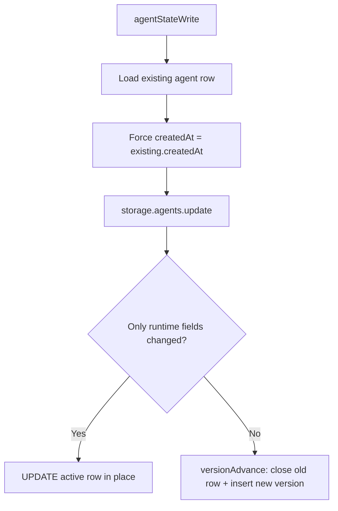

# Agent Runtime Versioning Fixes

## Summary

This change fixes two sources of unexpected `agents.version` churn:

1. `agentStateWrite(...)` no longer propagates caller-provided `createdAt` into storage updates.
2. `AgentsRepository.update(...)` now auto-generates `updatedAt` internally and ignores any caller-provided `updatedAt`.
3. Version advances now keep `createdAt` from the previous row.

The same timestamp policy was then applied to all other storage repositories that use temporal versioning and have
`createdAt`/`updatedAt` fields.

## Root Cause

`Agent.create(...)` and `agentWrite(...)` can use different `Date.now()` calls during creation.
That can produce a tiny `createdAt` mismatch between in-memory state and persisted agent row.
When state is written back, that mismatch looked like a non-runtime mutation and triggered `versionAdvance`.

Separately, external `updatedAt` values in updates made timestamp behavior inconsistent across code paths.

## Behavior After Fix

- State writes always preserve persisted agent `createdAt`.
- Update operations always generate `updatedAt` inside the repository.
- If a new version is created, the next row keeps the same `createdAt` as the previous row.
- If only runtime fields changed (`lifecycle`, `nextSubIndex`, `activeSessionId`, `updatedAt`), repository updates the current row in place.
- Temporal version advances are still used for identity/config mutations.

## Repositories Updated

- `agentsRepository`
- `channelsRepository`
- `tasksRepository`
- `processesRepository`
- `systemPromptsRepository`
- `usersRepository`
- `cronTasksRepository`
- `signalSubscriptionsRepository`
- `webhookTasksRepository`
- `documentsRepository`
- `exposeEndpointsRepository`

Note: `connectionsRepository` also uses temporal versioning but does not expose `createdAt`/`updatedAt` fields, so no
timestamp policy change was required there.

## Flow

