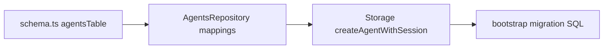
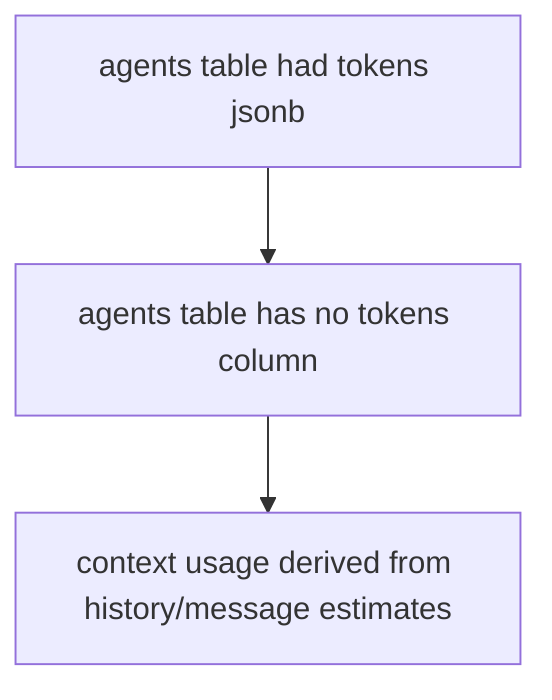

# Remove agents.tokens column

## Summary
- Removed `tokens` from the `agents` table schema.
- Removed `tokens` from storage row types and agent repository persistence logic.
- Updated bootstrap migration SQL and affected tests.

## Data model flow

## Result

