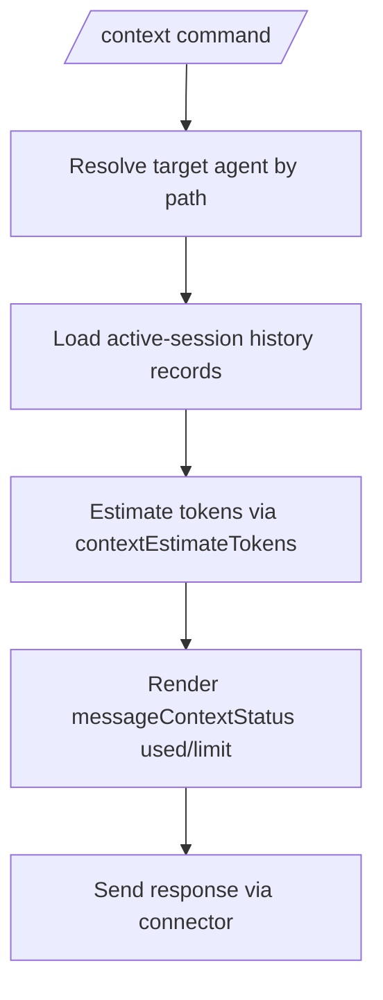

# AgentState token removal and message-based context usage

## Summary
- Removed `tokens` from `AgentState` persistence and runtime state.
- `/context` now estimates usage from session message history instead of reading cached token stats from agent state.
- `messageContextStatus` now renders estimate-only output.

## Flow update


## State update
```mermaid
flowchart LR
    Old[AgentState persisted tokens] --> Removed[No tokens field in AgentState]
    Removed --> Runtime[Compaction baseline reads latest assistant history tokens]
    Removed --> ContextCmd[/context uses history-based estimate]
```
