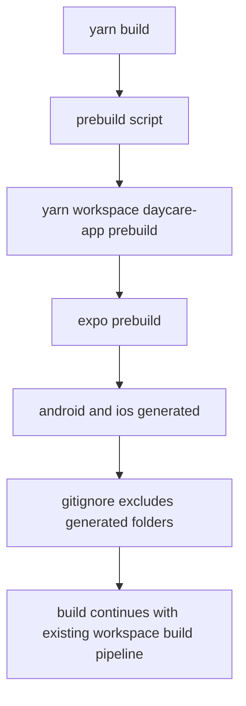

# App Prebuild And Nitro Modules

## Summary

Root build flow now runs the app prebuild step first, the app adds `react-native-nitro-modules`, and generated native folders are ignored.

## Changes

- Added root `prebuild` script to run `yarn workspace daycare-app prebuild`.
- Added `react-native-nitro-modules` to app dependencies.
- Added `packages/daycare-app/android` and `packages/daycare-app/ios` to `.gitignore`.
- Updated `yarn.lock` for the new app dependency.

## Flow

