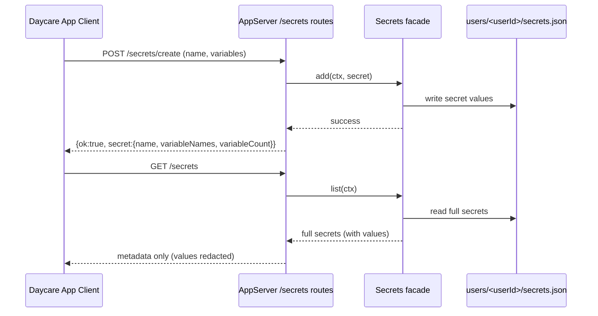

# Daycare App Secrets API

## Summary

Added authenticated secrets endpoints to the app API with full CRUD coverage.

- `GET /secrets`
- `GET /secrets/:name`
- `POST /secrets/create`
- `POST /secrets/:name/update`
- `POST /secrets/:name/delete`

All responses are metadata-only and never include secret variable values.

## Flow

