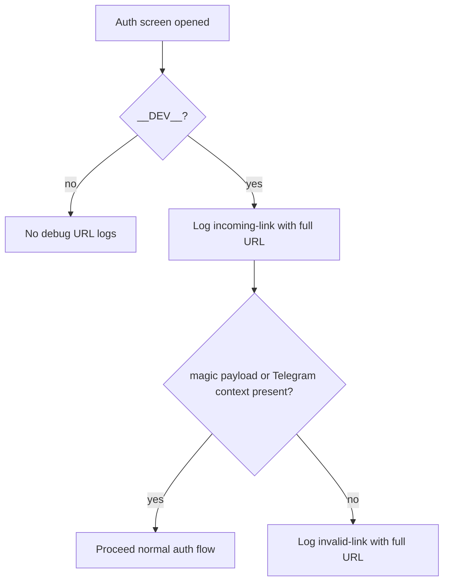

# Auth Full Link Debug Logging

## Summary

Added development-only logging of the full incoming auth URL on the app auth screen to debug deep-link payload loss in simulator/device flows.

## Behavior

- On auth screen mount (dev only), logs the full incoming URL.
- When auth link parsing fails (no magic payload and no Telegram context), logs the full URL again with `invalid-link` label.
- Logging is disabled in production builds.

## Flow

