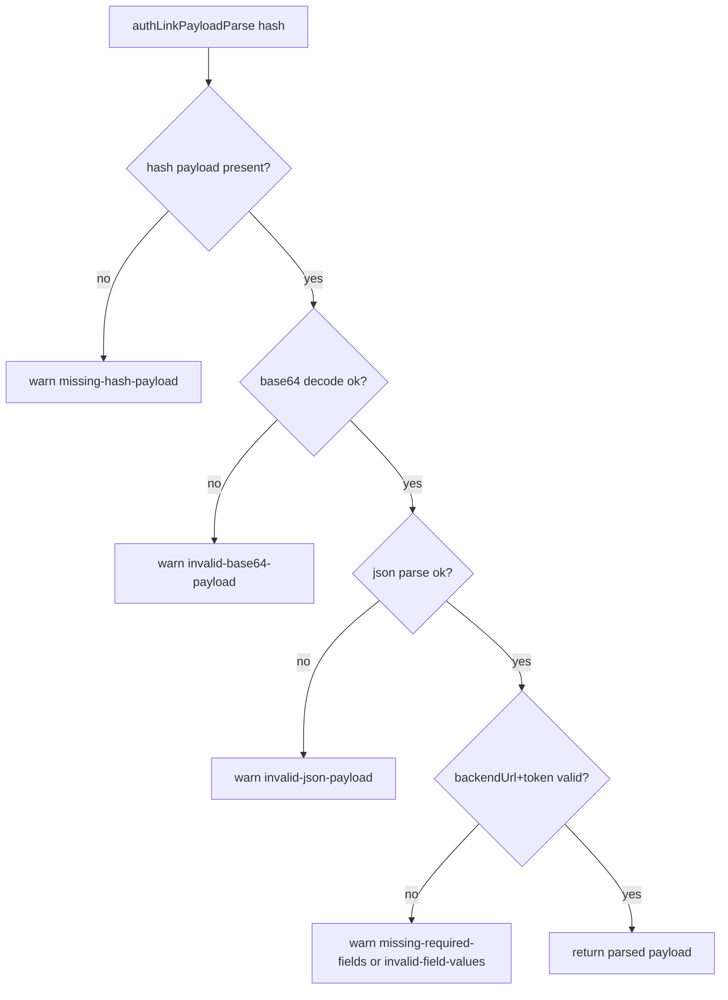

# Auth Invalid Link Logging

## Summary

Added explicit client-side logs when auth link hash parsing fails so simulator/device deep-link issues are visible in runtime logs.

## Behavior

- `authLinkPayloadParse` now logs a sanitized warning for invalid inputs.
- Log message includes:
  - parse failure reason;
  - encoded payload length.
- Log message does not include token or decoded payload content.

## Reasons

- `missing-hash-payload`
- `invalid-base64-payload`
- `invalid-json-payload`
- `missing-required-fields`
- `invalid-field-values`

## Flow

