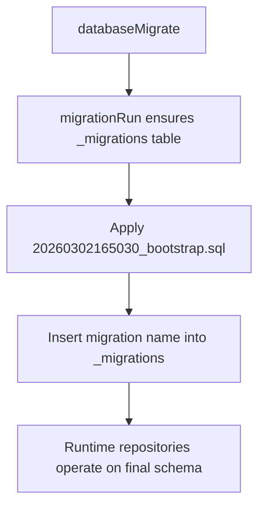

# Bootstrap migration reset (single-file)

## Summary
- Removed legacy incremental SQL migrations.
- Added one fresh bootstrap migration with timestamp prefix: `20260302165030_bootstrap.sql`.
- Updated migration registry to a single entry.
- Updated migration tests to validate bootstrap apply, schema parity, and idempotency.

## Migration flow

## Schema strategy

