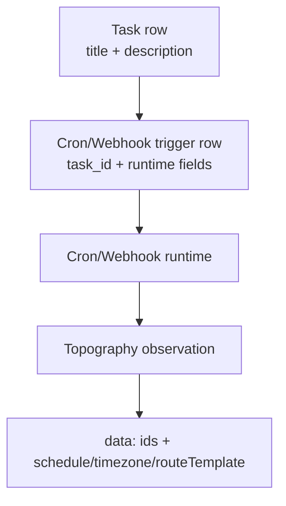

# Cron and webhook trigger metadata cleanup

## Summary
- Removed `name` and `description` from persisted cron trigger records.
- Kept task title/description as the only source of human-readable task metadata.
- Removed `name` from cron/webhook topography event payloads.

## Schema and migration
- `tasks_cron` no longer defines `name` or `description` in Drizzle schema/bootstrap SQL.
- Added migration `20260302173000_drop_cron_name_description.sql` for existing databases.

## Runtime behavior
- Cron scheduler now resolves task names from linked task rows when building task context.
- Cron and webhook observation event payloads now carry stable identifiers only.
- Topology tool cron trigger output no longer includes trigger `name`.

## Data flow

