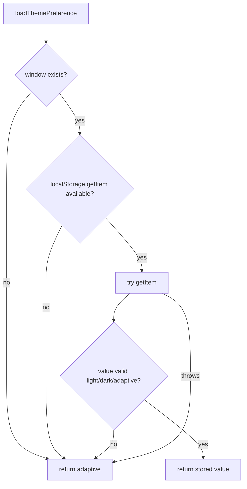

# iOS LocalStorage Runtime Guard

## Summary

Fixed app startup crash on iOS caused by theme persistence reading `window.localStorage` when `window` exists but `localStorage` is unavailable.

## Root Cause

- `loadThemePreference()` treated `window` availability as equivalent to browser storage availability.
- On React Native iOS, `window` can exist while `window.localStorage` is `undefined`.
- Startup theme bootstrap called `window.localStorage.getItem(...)`, causing:
  - `TypeError: Cannot read property 'getItem' of undefined`

## Changes

- Added guarded storage access in `sources/modules/state/persistence.ts`.
- Added regression tests in `sources/modules/state/persistence.spec.ts` for:
  - no `window`;
  - no `localStorage`;
  - valid stored value;
  - storage access throwing.

## Flow

