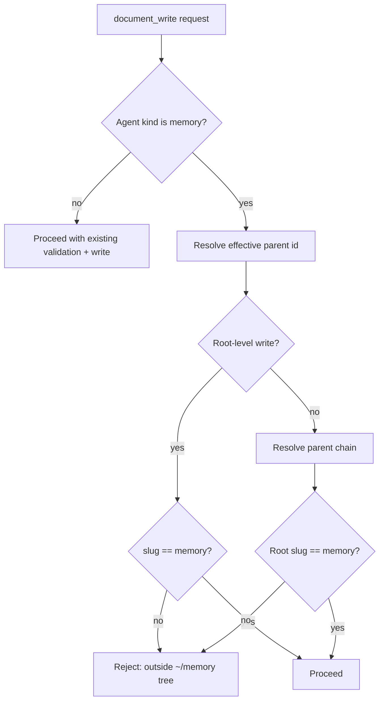

# Memory-Agent Document Tree Write Guard

## Summary

`document_write` now blocks memory-agents from creating or updating documents outside `~/memory`.

## Behavior

- The guard applies only when `toolContext.agent.config.kind === "memory"`.
- For create/update with explicit parent (`parentId` or `parentPath`), the resolved parent chain must have root slug `memory`.
- For create/update without explicit parent, the write is treated as root-level and only slug `memory` is allowed.
- Non-memory agents keep existing behavior.

## Flow

