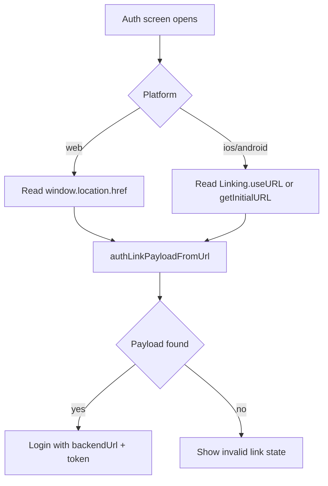

# Native Auth Deeplink Source (2026-03-02)

## Summary

Native auth now resolves incoming links from Expo Linking instead of `window.location`.
Web continues to use browser `window.location` for `/auth#...` links.

This fixes native invalid-link cases where runtime `window.location.href` points to Metro (`http://<lan-ip>:8081/`) instead of the actual deeplink.

## Flow

## Supported Payload Formats

- `https://app.example.com/auth#<base64url-json>` (existing web format)
- `daycare://auth#<base64url-json>` (native hash deeplink)
- `daycare://auth?payload=<base64url-json>` (native query deeplink)
