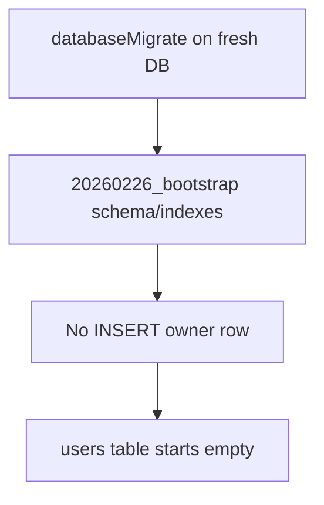

# Remove owner bootstrap seeding

## Summary
- Removed automatic owner user insertion from SQL bootstrap migration.
- Kept test stability by seeding a test-only owner in `storageOpenTest()`.
- Updated owner-migration test setup to create an explicit non-owner user instead of relying on bootstrap data.

## Migration behavior


## Test behavior
```mermaid
flowchart TD
    T[storageOpenTest] --> M[Run migrations]
    M --> Q[Check storage.users.findOwner()]
    Q -->|missing| S[Create test owner sy45...]
    Q -->|exists| R[Reuse existing owner]
```
