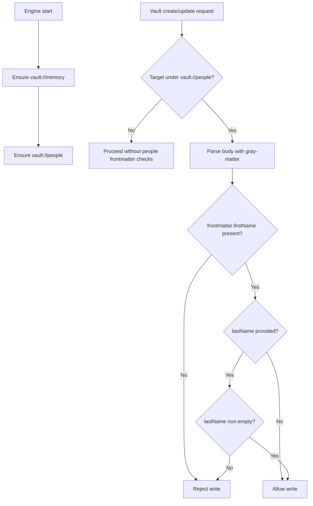

# People Root Document + Frontmatter Validation

## Summary

- Added automatic `vault://people` root entry creation at engine startup.
- Added validation for vault writes under `vault://people`:
  - YAML frontmatter is required implicitly by requiring frontmatter fields.
  - `firstName` must be present and non-empty.
  - `lastName` is optional, but when provided it must be non-empty.
- Applied the validation in both:
  - `vault_write` tool writes
  - App vault API writes (`POST /vault/create`, `POST /vault/:id/update`)

## Flow

