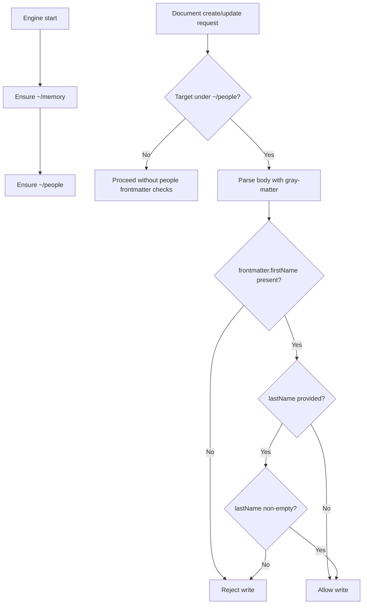

# People Root Document + Frontmatter Validation

## Summary

- Added automatic `~/people` root document creation at engine startup.
- Added validation for document writes under `~/people`:
  - YAML frontmatter is required implicitly by requiring frontmatter fields.
  - `firstName` must be present and non-empty.
  - `lastName` is optional, but when provided it must be non-empty.
- Applied the validation in both:
  - `document_write` tool writes
  - App document API writes (`POST /documents`, `PUT /documents/:id`)

## Flow

