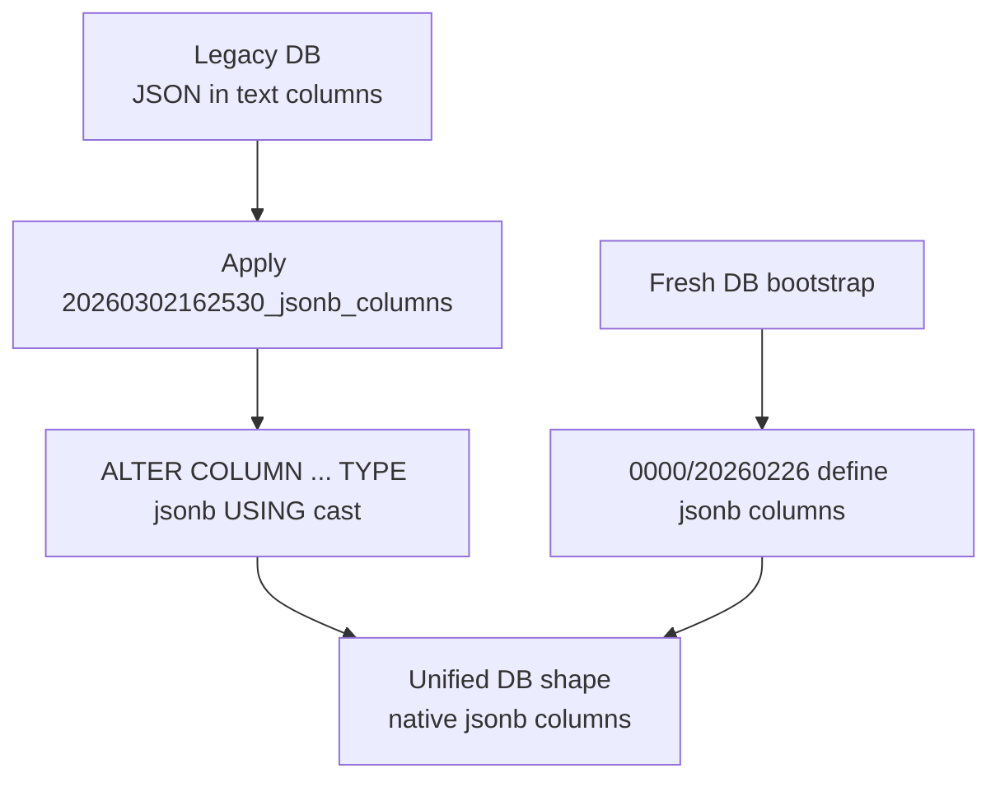
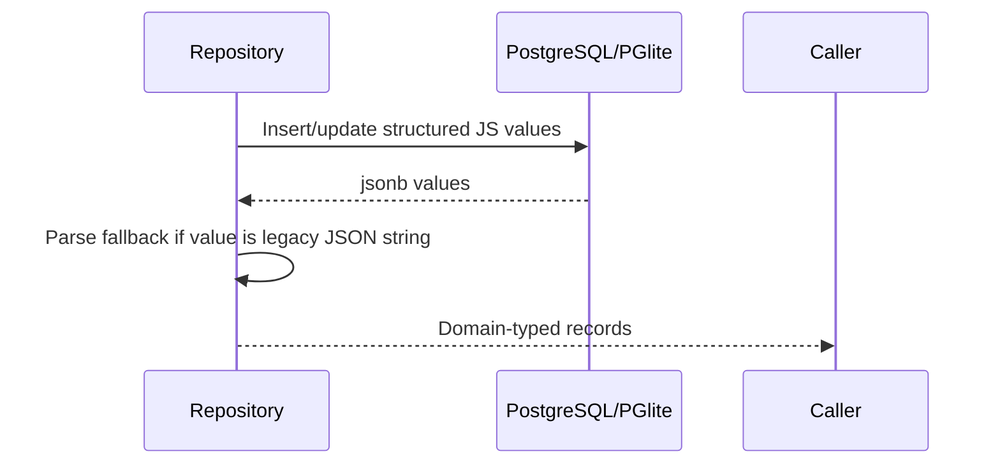

# Storage jsonb columns

## Summary
- Replaced JSON-serialized `text` storage columns with native PostgreSQL `jsonb` where values are structured data.
- Updated Drizzle schema and migrations so both fresh databases and existing databases converge to the same `jsonb` shape.
- Kept repository contracts stable by parsing legacy string rows when needed and preserving existing external interfaces (for example durable inbox still returns string payloads).

## Updated columns
- `agents.permissions`, `agents.tokens`
- `session_history.data`
- `inbox.data`
- `tasks.parameters`, `tasks_cron.parameters`
- `signals_events.source`, `signals_events.data`
- `signals_delayed.source`, `signals_delayed.data`
- `channel_messages.mentions`
- `expose_endpoints.target`, `expose_endpoints.auth`
- `processes.env`, `processes.package_managers`, `processes.allowed_domains`, `processes.permissions`, `processes.owner`
- `observation_log.data`

## Migration flow

## Repository behavior

## Validation
- Storage + expose suites pass after conversion (agents, tasks, cron, history, inbox, processes, signals, observation log, migrations, expose).
- Agent durable inbox and state tests pass with jsonb-backed inbox/history paths.
