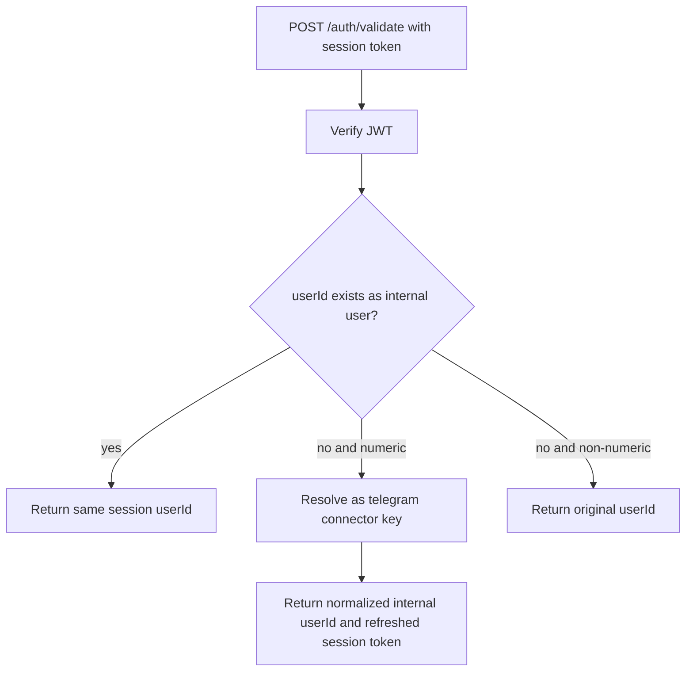

# Telegram auth returns internal user IDs

## Summary

- `POST /auth/telegram` now maps Telegram external user IDs to internal Daycare user IDs before issuing session JWTs.
- `POST /auth/validate` now normalizes legacy session tokens that still contain Telegram external IDs.
- `POST /auth/refresh` now applies the same session user ID normalization.

This fixes app auth state showing Telegram IDs (for example `215026574`) instead of internal system user IDs.

## Flow

```mermaid
flowchart TD
    A[Telegram WebApp initData] --> B[Validate initData signature]
    B --> C[Extract telegramUserId]
    C --> D[Find user by connector key telegram:telegramUserId]
    D -->|found| E[Use existing internal userId]
    D -->|not found| F[Create user with connector key]
    F --> E
    E --> G[Sign session JWT with internal userId]
    G --> H[Return { ok, userId, token, expiresAt }]
```

## Legacy token normalization


