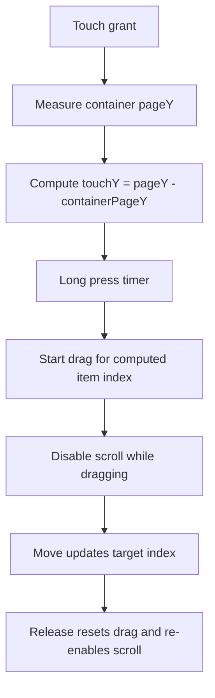

# Daycare App Todo Mobile Touch Fix

This change fixes mobile drag behavior in the todo list.

## Problem

On mobile, long-pressing an item could start dragging the wrong row (often the top row), and the list could continue scrolling during drag.

## Root Cause

- Touch index was derived from `locationY`, which is relative to the touched child view and not the full list container.
- While dragging, the scroll view remained enabled, so gesture intent competed with scroll.

## Fix

- In `ReorderingList2`, item hit detection now uses container-relative coordinates computed from `pageY - containerPageY`.
- Container position is measured on layout and refreshed on touch grant/release.
- Scroll is disabled while a drag is active (`scrollEnabled={draggingKey === ""}`).
- Tap detection uses the same container-relative coordinate path for correctness.

## Flow

