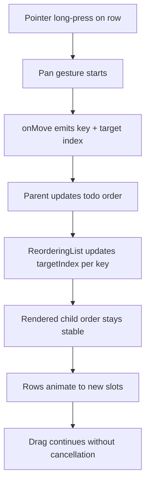

# Daycare App Todo Web Touch Hack Alignment

This change aligns todo touch interactions with the original `happy-list` behavior for web.
The issue was drag/touch instability caused by list child reordering during active drag updates.

## What changed

- Restored web gesture handling in todo row interactions:
  - checkbox tap
  - title overlay tap
  - favorite star tap
- Restored web gesture handling in task header row taps.
- Reintroduced the web-specific drag stability hack in `ReorderingList`:
  - keep rendered child order stable across reorder updates
  - only remove missing keys and append truly new keys
  - continue animating each row to target index instead of reordering DOM children

## Why this works

On web, changing child render order while a pointer drag is active can cancel the gesture.
By keeping child order stable and updating only animated positions, the drag gesture remains active and consistent.

## Flow

