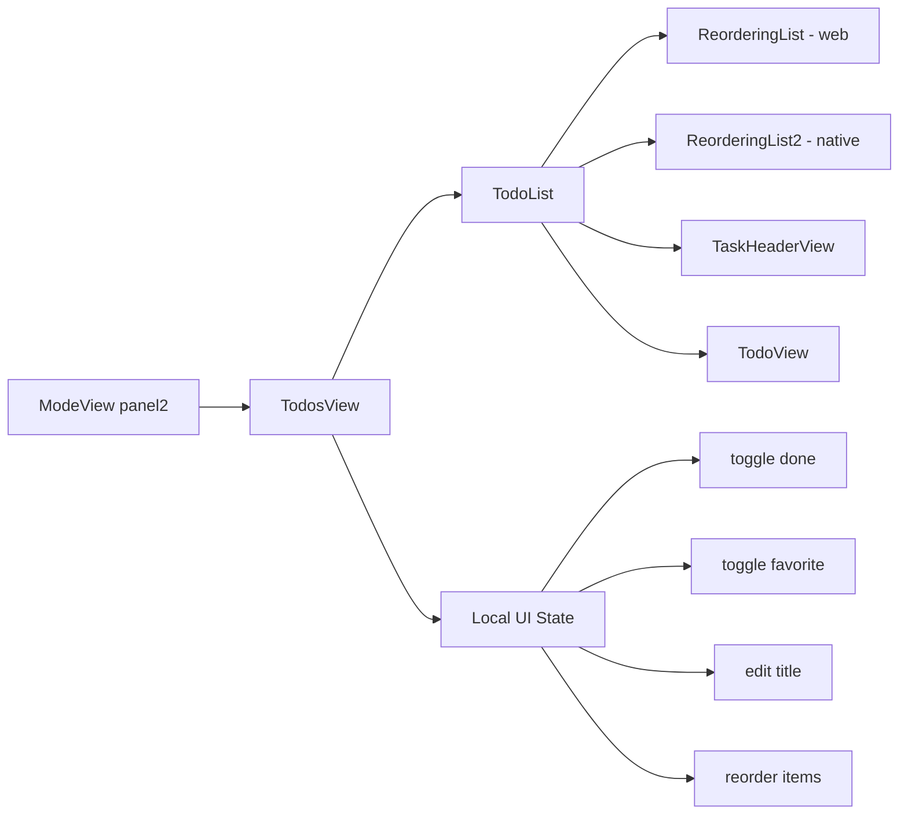

# Daycare App Todo UI Port (happy-list)

This change ports the todo list UI from `~/Developer/happy-list` into `packages/daycare-app` as local-only UI.
No API/store wiring is used.

## What was added

- `sources/views/todos/TodoView.tsx`: task row UI (edit title, toggle done, favorite, indicators).
- `sources/views/todos/TaskHeaderView.tsx`: section header row (`# Header`).
- `sources/views/todos/TodoList.tsx`: list renderer that switches between web/native drag implementations.
- `sources/components/ReorderingList.tsx`: web-oriented drag-and-drop implementation.
- `sources/components/ReorderingList2.tsx`: native-oriented drag-and-drop implementation.
- `sources/views/todos/todoTypes.ts`: UI-only todo types.
- `sources/views/TodosView.tsx`: central panel wiring with local in-memory data and handlers.

## Architecture

