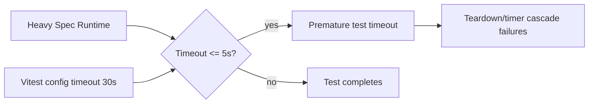

# Daycare Vitest Timeout Stabilization

## Summary

Increased `packages/daycare` Vitest timeouts to reduce false negatives from default 5-second limits in heavy integration specs.

## Change

- `packages/daycare/vitest.config.ts`
  - `testTimeout: 30_000`
  - `hookTimeout: 30_000`

## Rationale

The package runs many integration-like tests with filesystem, process, and plugin work. Under load, several tests exceeded 5 seconds and triggered cascading failures (timer cleanup and teardown errors).

## Flow

