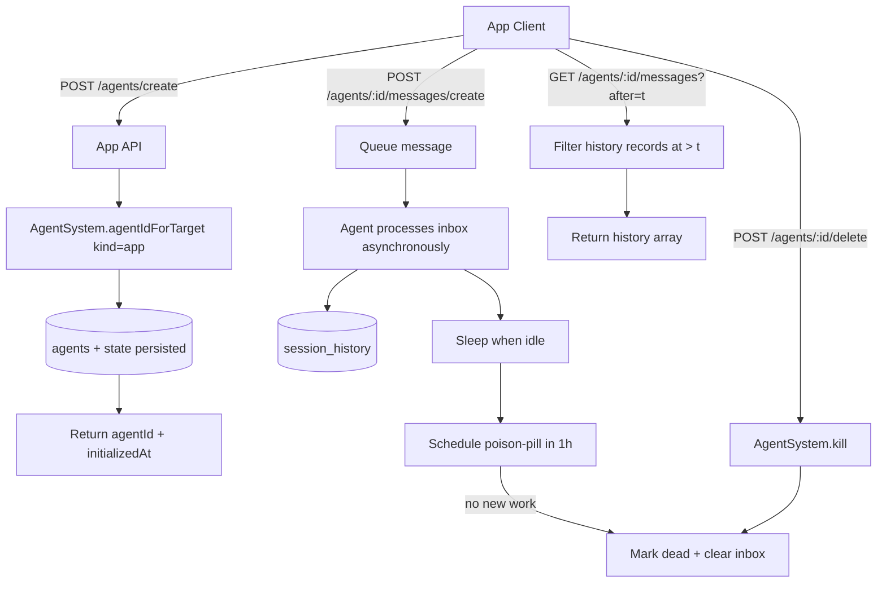

# App Agent API Lifecycle

## Summary

Added a first-class `app` agent kind and action-based app API routes for lifecycle management:

- `POST /agents/create` creates an app agent from a system prompt and returns `{ agentId, initializedAt }`.
- `POST /agents/:id/messages/create` queues an async message to that agent.
- `GET /agents/:id/messages?after=<unix-ms>&limit=<n>` returns history records newer than `after`.
- `POST /agents/:id/delete` kills the agent.

Runtime lifecycle now treats `app` agents like ephemeral workers for inactivity termination:

- when an `app` agent sleeps, a poison-pill signal is scheduled for one hour later.
- waking the agent cancels and reschedules that timer.
- firing the timer marks the agent dead and clears pending inbox rows.

## Flow

