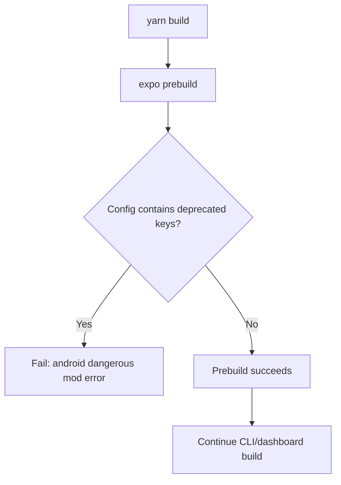

# App Expo Prebuild Config Migration

## Summary

Build failed during `expo prebuild` because deprecated Expo config keys were still present in `packages/daycare-app/app.config.js`.

Changes:
- Removed `expo.notification` from app config.
- Removed `android.edgeToEdgeEnabled` from app config.
- Kept the rest of the app config unchanged.

## Flow

