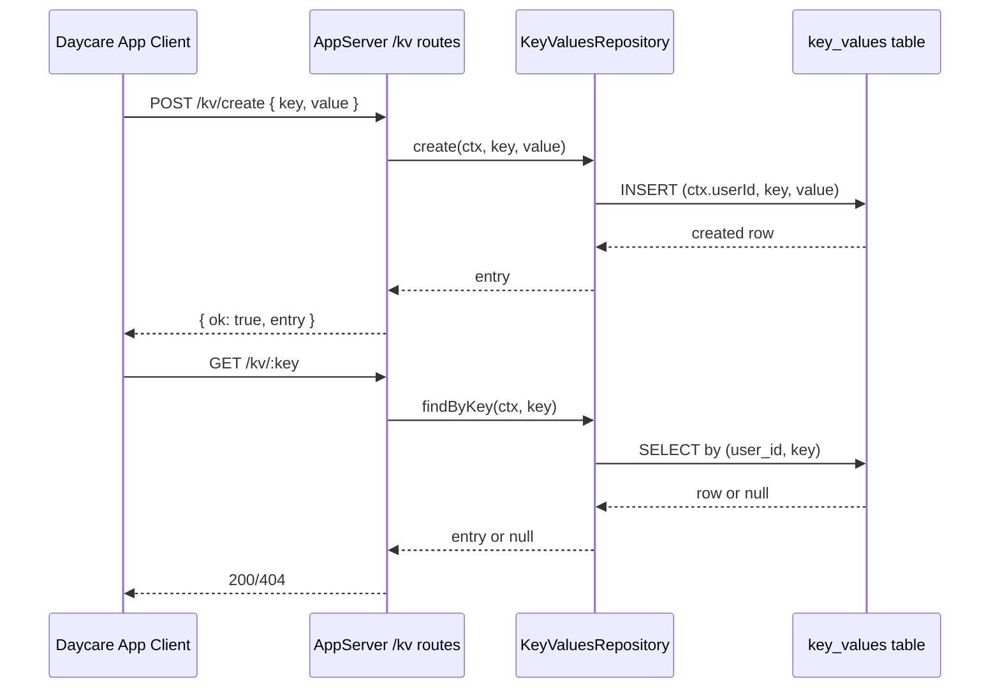

# Daycare App Per-User KV Storage

## Summary

Added untyped key-value storage scoped by `ctx.userId` in core storage and exposed it in the authenticated App API.

Storage:
- New `key_values` table (`user_id`, `key`, `value`, `created_at`, `updated_at`)
- New `KeyValuesRepository` on `Storage` facade
- New migration: `20260303101000_user_key_values.sql`

API:
- `GET /kv`
- `GET /kv/:key`
- `POST /kv/create`
- `POST /kv/:key/update`
- `POST /kv/:key/delete`

## Flow

