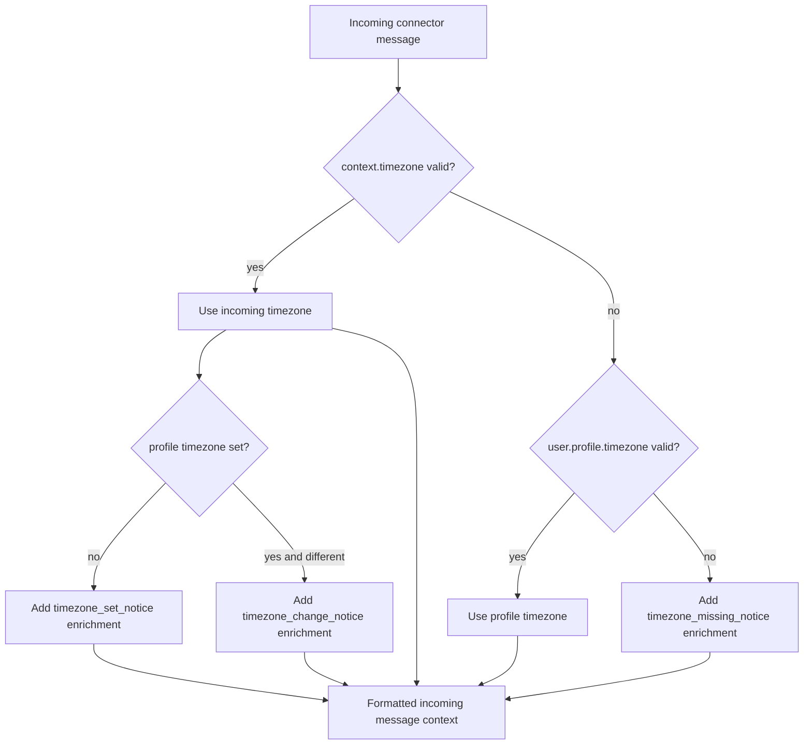

# Telegram Timezone Context Nudge

## Summary
- Telegram connector messages currently provide `messageId` but not `timezone`.
- Engine context enrichment resolves timezone from incoming context or user profile.
- Added model guidance enrichments:
  - set timezone automatically when available in context and profile is unset
  - update timezone when context timezone differs from profile
  - ask user when timezone is missing in both places

## Flow

## Enrichments
- `timezone_set_notice`: emitted when timezone exists in context and profile timezone is unset; instructs model to set it via `user_profile_update`.
- `timezone_change_notice`: emitted when incoming timezone differs from profile timezone; instructs model to update profile via `user_profile_update`.
- `timezone_missing_notice`: emitted when both incoming and profile timezone are unavailable.
