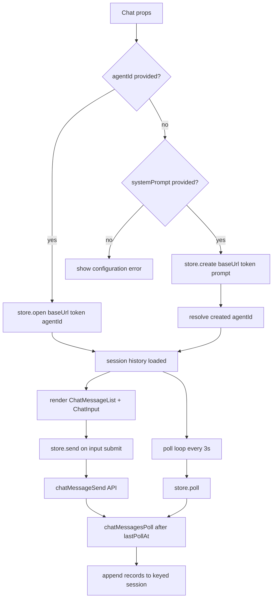
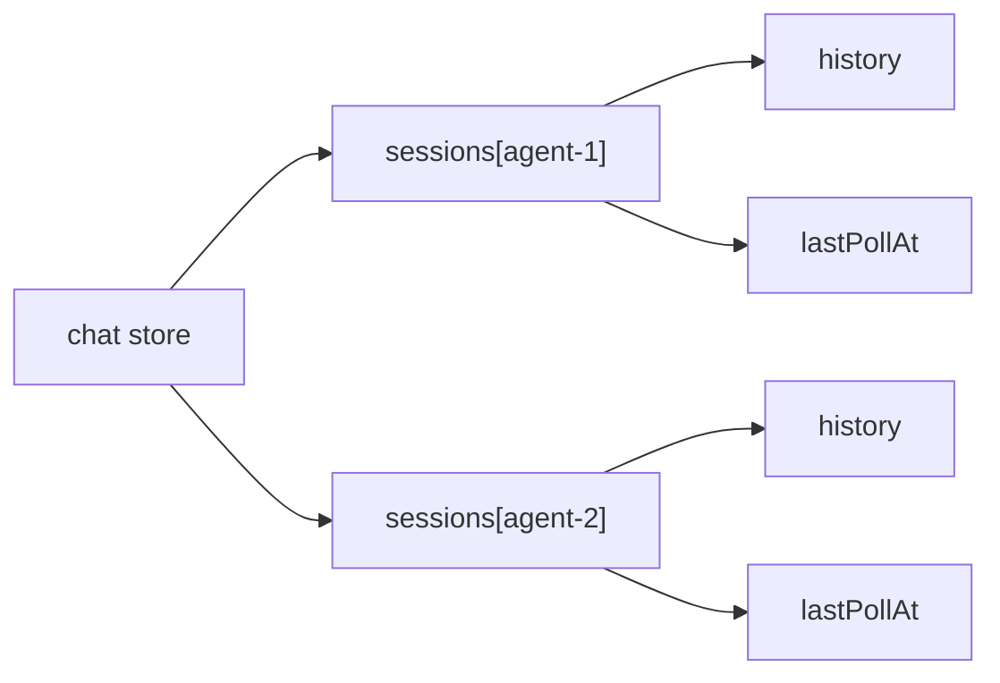

# App Chat Component Extraction

## Summary

Extracted reusable chat UI/state from `views/agents` + `modules/agents` into a standalone `modules/chat` module.

Key changes:

- Added `Chat.tsx` for controlled (`agentId`) and auto-create (`systemPrompt`) modes.
- Added `chatApi.ts` for create/history/send/poll API operations.
- Added global keyed chat Zustand store in `chatStoreCreate.ts` with `open/create/send/poll`.
- Moved chat UI pieces to `modules/chat`:
  - `ChatInput.tsx`
  - `ChatMessageList.tsx`
  - `ChatMessageItem.tsx`
  - `chatHistoryTypes.ts`
  - `chatMessageItemHelpers.ts`
- Rewired `AgentDetailView` to render `<Chat agentId={agentId} />`.
- Simplified `agentsStoreCreate.ts` to list-fetch responsibilities only.
- Removed deprecated agent chat files:
  - `agentsHistoryFetch.ts`
  - `agentsMessageSend.ts`
  - `agentsMessage.ts`

## Runtime Flow

## State Shape

