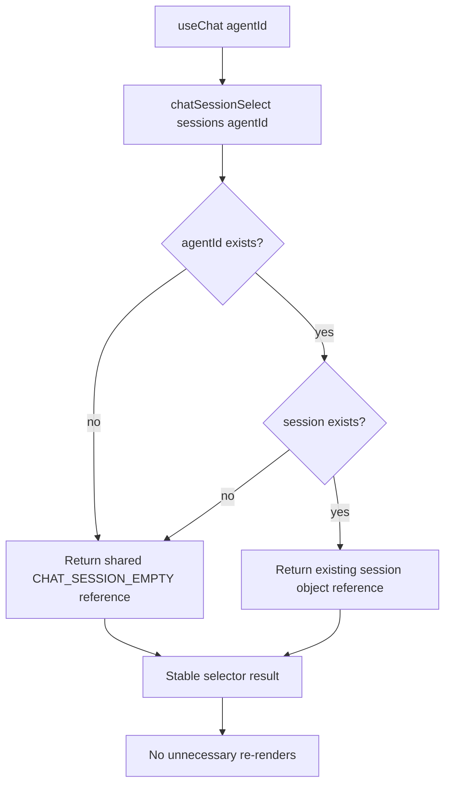

# Daycare App Chat Maximum Update Depth Fix

## Summary

Fixed a render loop in the app chat module by making chat session selection return stable references.

Changes:

- Added `chatSessionSelect.ts` to select `ChatSessionView` without creating new objects per render.
- Updated `chatContext.ts` to use `chatSessionSelect`.
- Added `chatSessionSelect.spec.ts` to verify stable empty-view and session reference behavior.

This prevents repeated selector value churn that can cascade into repeated updates in React render cycles.

## Selector Flow

