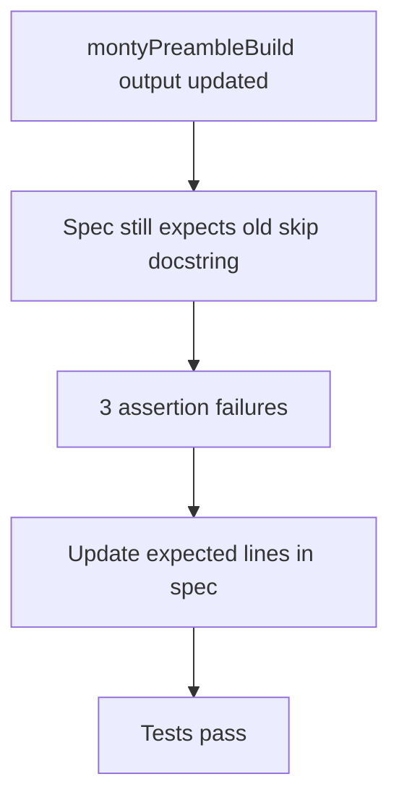

# Monty Preamble Skip Docstring Test Sync

## Summary

`montyPreambleBuild` emits an updated `skip()` docstring that explains runtime behavior more explicitly.
`montyPreambleBuild.spec.ts` still expected the old text and failed three snapshot-style assertions.

Changes:
- Updated all three expected `skip()` docstring lines in `montyPreambleBuild.spec.ts`.
- No runtime behavior changes; test expectations now reflect current output.

## Flow

