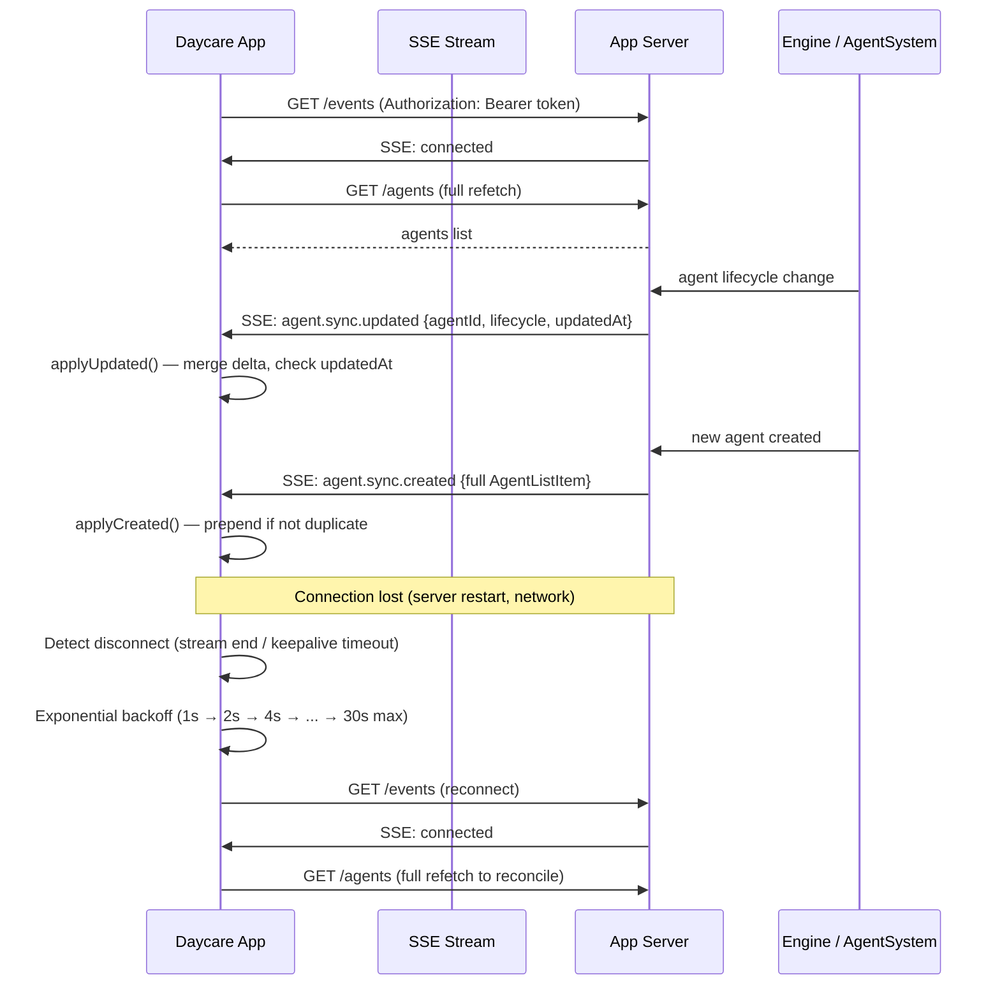

# Reliable SSE Sync Architecture

## Overview

Real-time sync between the Daycare app and server using Server-Sent Events (SSE). The server pushes granular agent change events to connected clients. The app applies deltas to its Zustand stores with version-based conflict resolution. On reconnection, a full refetch reconciles any missed events.

## Architecture

## Event Types

| Event | Payload | Emitted When |
|-------|---------|-------------|
| `agent.sync.created` | Full agent fields | Agent created |
| `agent.sync.updated` | `{agentId, lifecycle?, name?, updatedAt}` | Lifecycle change, config update |
| `agent.sync.deleted` | `{agentId}` | Agent killed |

Events are user-scoped via `userId` field — each SSE stream only receives events for the authenticated user.

## Conflict Resolution

- Each agent carries `updatedAt` (unix ms timestamp)
- `applyUpdated()` skips if incoming `updatedAt <= stored updatedAt`
- Full refetch on reconnect is authoritative (replaces entire agent list)

## Keepalive

- Server sends `:keepalive\n\n` SSE comment every 30 seconds
- Client treats 60 seconds without any data as a dead connection
- Prevents proxy timeout closures

## Key Files

### Server (`packages/daycare`)
- `sources/engine/ipc/events.ts` — EngineEventBus with userId support
- `sources/api/routes/events/eventsStream.ts` — SSE stream with user filtering + keepalive
- `sources/engine/agents/ops/agentEventEmit.ts` — sync event emission helper
- `sources/engine/agents/agentSystem.ts` — emits sync events on lifecycle changes
- `sources/engine/agents/agent.ts` — emits sync event on agent creation

### App (`packages/daycare-app`)
- `sources/modules/sync/sseClientCreate.ts` — fetch-based SSE client
- `sources/modules/sync/sseLineParse.ts` — SSE line/buffer parsing
- `sources/modules/sync/syncStoreCreate.ts` — connection lifecycle + reconnection store
- `sources/modules/sync/syncEventTypes.ts` — typed event discriminated union
- `sources/modules/sync/syncBackoff.ts` — exponential backoff computation
- `sources/modules/sync/SyncProvider.tsx` — React component wiring auth → sync → agents
- `sources/modules/agents/agentsStoreCreate.ts` — delta merge methods (applyCreated/Updated/Deleted)

## Extending to Other Entities

To add sync for tasks, documents, etc.:

1. **Server**: emit `task.sync.created` / `task.sync.updated` events from the relevant engine code using `agentEventEmit` pattern
2. **App**: add event types to `syncEventTypes.ts`, add delta methods to the domain store, add dispatch cases in `syncStoreCreate.ts`
