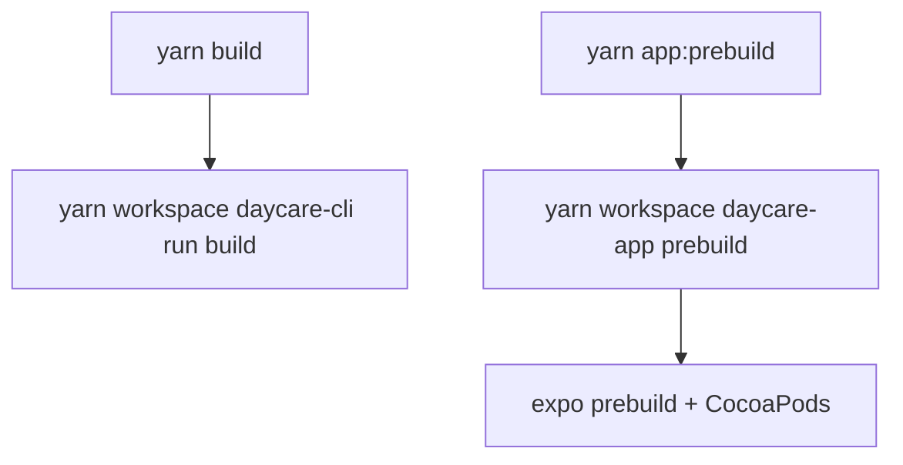

# Root Build Prebuild Decoupling

## Summary

`yarn build` at the repository root triggered root `prebuild` automatically, which ran `expo prebuild` from `daycare-app`.
That path requires iOS/CocoaPods tooling and blocks/fails in Linux CI.

Changes:
- Removed root `prebuild` script.
- Added explicit `app:prebuild` script for manual native scaffold generation.
- Kept root `build` focused on `daycare-cli` build/export only.

## Flow

