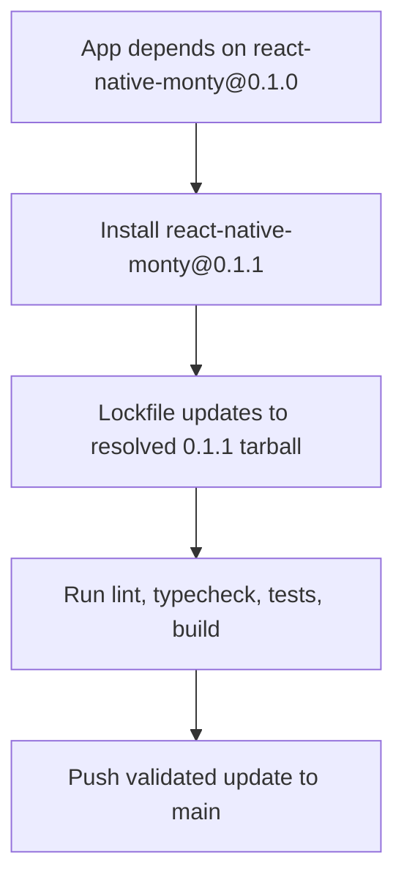

# App Monty 0.1.1 Upgrade

## Summary

Updated `react-native-monty` in `daycare-app` from `0.1.0` to `0.1.1` to pick up the latest published package fixes and runtime improvements.

## Changes

- Updated `packages/daycare-app/package.json` dependency:
  - `react-native-monty: ^0.1.0` -> `^0.1.1`
- Updated lockfile entries in `yarn.lock`.

## Flow

