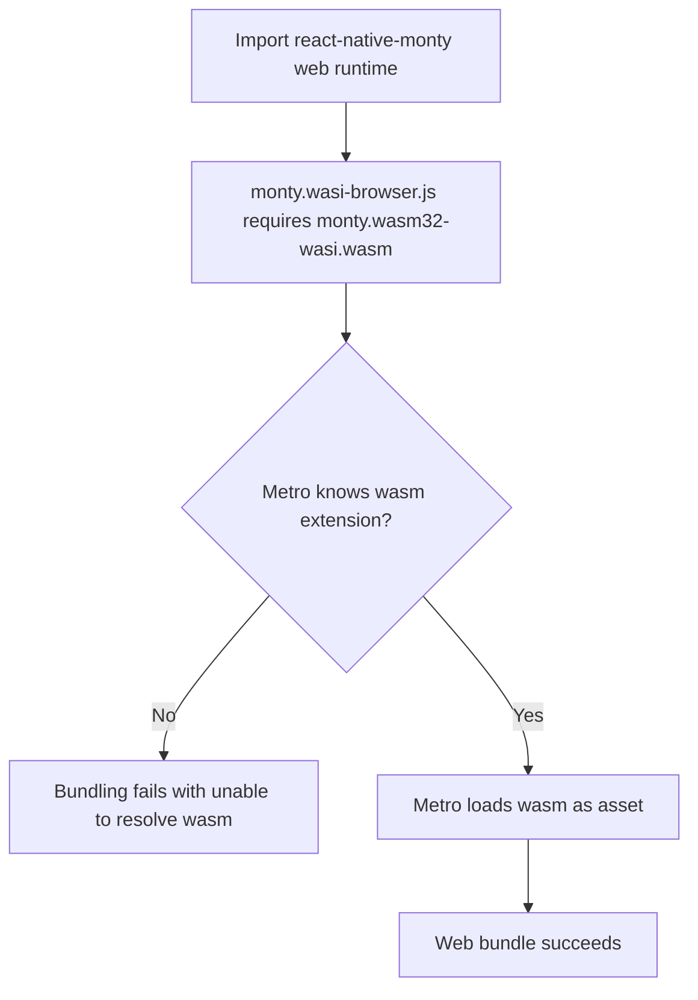

# App Monty Web Wasm Resolution

## Summary

Web bundling failed after adding `react-native-monty` because Metro did not resolve `.wasm` assets by default.
The app now registers `wasm` in Metro asset extensions so Monty web runtime files resolve during bundling.

## Changes

- Updated `packages/daycare-app/metro.config.js` to add `wasm` to `config.resolver.assetExts`.

## Flow

