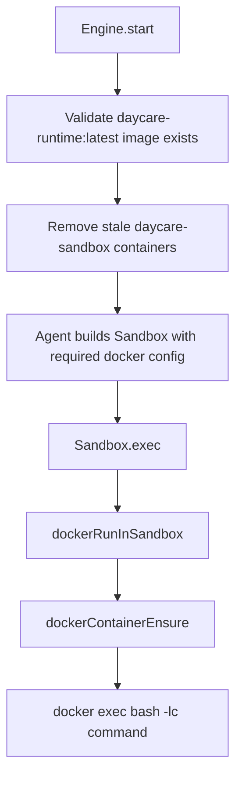

# Daycare Docker-Only Sandbox Execution

## Summary
- Removed the inner `sandbox-runtime` layer from Daycare command execution.
- `Sandbox.exec()` now always runs in Docker and always uses the fixed image `daycare-runtime:latest`.
- Per-command network allowlists and package-manager hints were removed from sandbox and process APIs.
- Engine startup now fails fast when the required Docker image is missing.

## Code Changes
- `packages/daycare/sources/sandbox/sandbox.ts`
  - Removed `allowedDomains` and package-manager handling from `exec()`.
  - Always routes command execution through `dockerRunInSandbox()`.
- `packages/daycare/sources/sandbox/docker/dockerRunInSandbox.ts`
  - Replaced the inner sandbox wrapper with direct `bash -lc` execution in the container.
- `packages/daycare/sources/engine/processes/processes.ts`
  - Removed sandbox config-file generation and direct inner-sandbox process spawning.
- `packages/daycare/sources/settings.ts`
  - Simplified Docker settings to runtime and security controls only.
- `packages/daycare/sources/engine/engine.ts`
  - Validates `daycare-runtime:latest` on startup and removes stale sandbox containers.

## Runtime Flow

## Why
- There is now a single execution boundary to reason about: the per-user Docker container.
- Removing the inner sandbox eliminates duplicated policy plumbing and the `allowedDomains`/`packageManagers`
  surface area from tools and processes.
- Startup validation catches misconfigured environments immediately instead of failing on the first command run.
