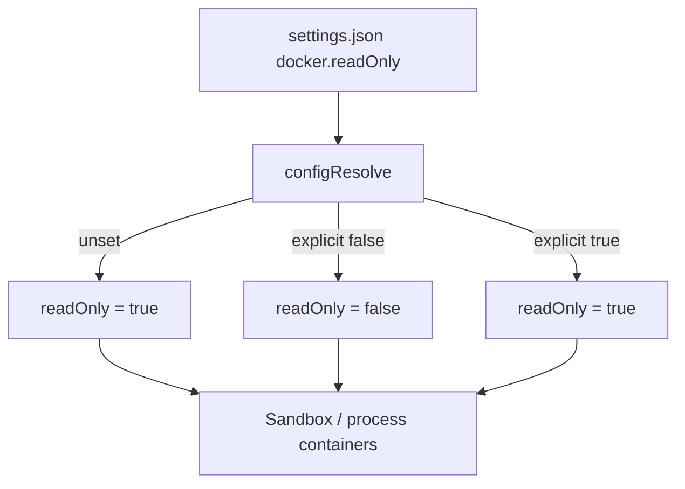

# Docker Readonly Default

Docker sandboxing now defaults to a read-only root filesystem when `docker.readOnly` is omitted.

This only changes the default. Callers can still opt out with `docker.readOnly: false`.
