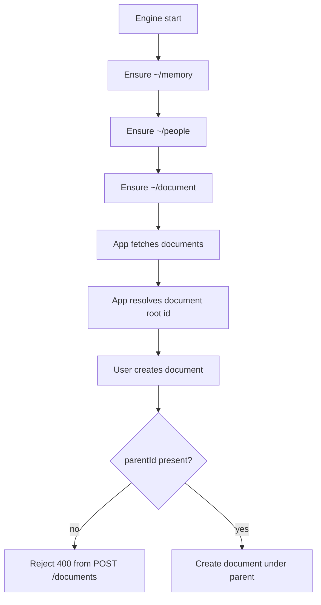

# Document Parent Enforcement And Root Ensure

## Summary

- `POST /documents` now requires `parentId`.
- Engine startup now ensures `~/document` exists for the owner user.
- App document creation paths now default to the ensured `~/document` id when no explicit parent is chosen.

## Flow

## Notes

- This keeps root-level user document creation blocked while still allowing root setup via engine ensure functions.
