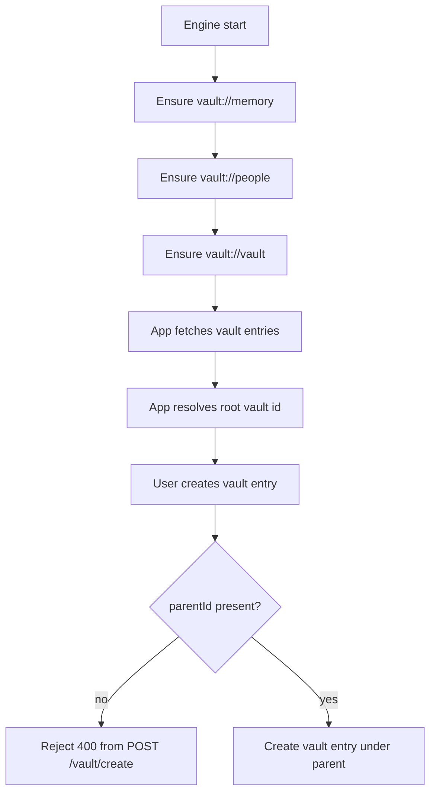

# Document Parent Enforcement And Root Ensure

## Summary

- `POST /vault/create` now requires `parentId`.
- Engine startup now ensures `vault://vault` exists for the owner user.
- App vault creation paths now default to the ensured root vault id when no explicit parent is chosen.

## Flow

## Notes

- This keeps root-level user vault creation blocked while still allowing root setup via engine ensure functions.
